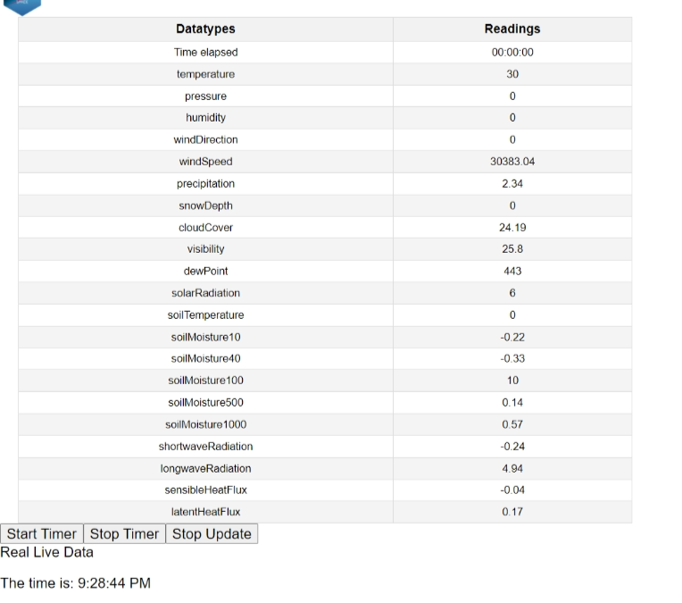

# Live Data Dashboard
*The Live Data Dashboard is a web application that displays real-time data from multiple sources in a table format. The application is built using HTML, CSS, and JavaScript.*

# How it Works

The Live Data Dashboard uses a JavaScript function to fetch data from a list  that represent instances of a class constructor. The data is then displayed in a table format using HTML and CSS. The table is updated every 5 seconds with new data.

# Usage

To use the Live Data Dashboard, simply open the index.html file in your web browser. The table will be displayed with real-time data. To stop the table from updating, click the "Stop Update" button. To resume updating the table, click the "Resume Update" button.

# Installation and Usage
To use this project, simply download the files and open the HTML file in a web browser. The webpage will display the table of data, the current time, and the start and stop buttons for the timer. Click the start button to start tracking the elapsed time, and click the stop button to stop the timer.

# Future Development
Possible future developments for this project include:
 >Addition of a search bar or dropdown menu
 > Data export functionality
> User authentication

## LICENSE

**Open to Experiemnt**

BY:Robert Smith

Credit:University of Advancing Tech

Email : Roberts.track@yahoo.com